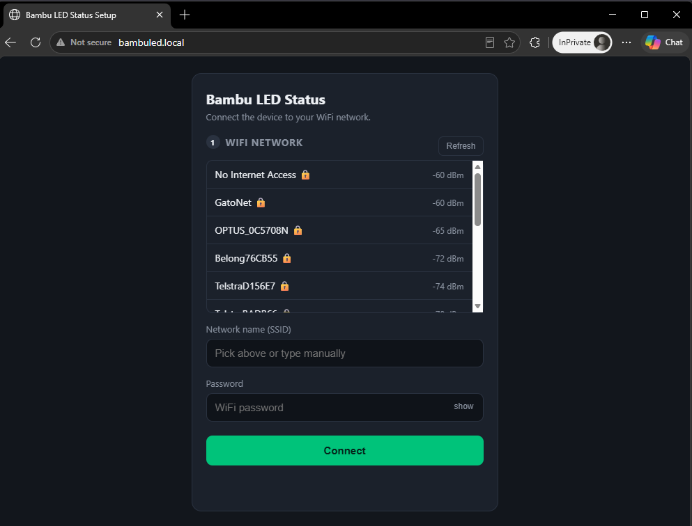
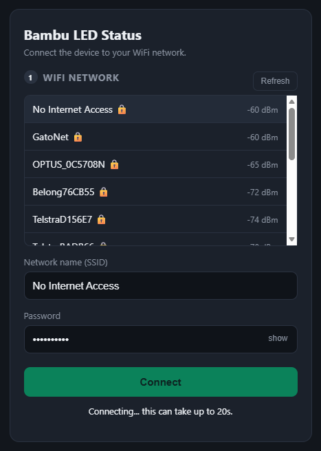
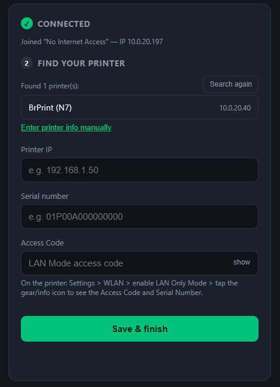
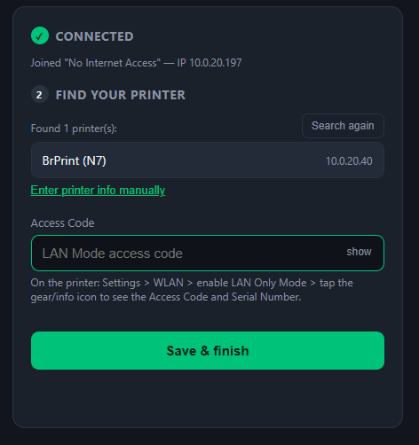

# Bambu LED Status Bar

An ESP32 that talks **directly** to your Bambu Lab printer over MQTT (LAN Mode) and turns
a WS2811 LED strip into a progress/status bar. No Home Assistant, no WLED, no cloud —
just the ESP32 and the printer. It's the successor to
[Bambu Lab P2S LED Progress/Status Bar](https://makerworld.com/en/models/2172105-bambu-lab-p2s-led-progress-status-bar),
which needed a whole ESP32 + WLED + Home Assistant automation stack to do the same thing.

## What it does

- Connects straight to the printer's LAN Mode MQTT broker (TLS, port 8883). That's it —
  no Bambu Studio, no Handy app, nothing else running.
- Web-based setup wizard for WiFi + printer discovery. No credentials baked into the
  firmware, no recompiling every time you want to point it at a different printer.
- 6 printer states, each with its own LED animation (idle, calibrating, printing, paused,
  finished, error). "Calibrating" covers heating, homing, leveling and filament changes —
  anything that isn't idle, actively extruding, paused, done, or errored.
- Colors and brightness are editable live from the web UI — no need to touch the code.
- Dims itself when the printer's chamber light is off, and shows a distinct blink pattern
  when it can't reach the printer, so you're never left guessing what's going on.
- A finished print goes back to idle on its own after a bit, instead of sitting there
  green forever.
- There's a little diagnostics log built into the web UI so you can see what the
  firmware's doing without dragging out a USB cable and PlatformIO.
- Flashes over plain USB. No app, no account, no subscription.

## Hardware

- Any ESP32-WROOM-32 DevKit works (don't need PSRAM or anything fancy).
- A WS2811 strip (WS2812/compatible too, just flip `LED_COLOR_ORDER`) — 10 segments by
  default, one per 10% of print progress.

### Wiring it up

| Strip | ESP32 |
|---|---|
| **DIN** (data) | GPIO16 |
| **GND** | Any GND pin — they're all the same net |
| **+5V** | ESP32's 5V/VIN pin, or a separate 5V supply — see below |

- Toss a ~300-500Ω resistor in series on the data line, right before the first LED, if
  you get flicker or a weird color on that first pixel.
- Colors look wrong/swapped? Flip `LED_COLOR_ORDER` from `RGB` to `GRB` in
  [AppConfig.h](include/AppConfig.h).
- **Power**: we measured ~270mA peak for 10 LEDs at full brightness, which a normal USB
  port handles fine — you can power the whole thing off the ESP32's own USB. If you do
  use a separate 5V supply (say, for a longer strip), just make sure its GND is tied to
  the ESP32's GND too. Skipping that shared ground is a good way to get flaky data and a
  confusing debugging session.

## Getting it running

**Just want to flash it, not hack on the code?** Skip all of this —
[flash it straight from your browser](https://brunohvp.github.io/Bambu-LED-Status-Bar/)
(Chrome or Edge, USB cable, no software install). Otherwise, to build from source:

1. Grab [VS Code](https://code.visualstudio.com/) and the **PlatformIO IDE** extension.
2. Open this folder in VS Code — PlatformIO picks up `platformio.ini` and pulls the
   dependencies on its own.
3. Plug in the ESP32 over USB and run:

```bash
pio run -t upload
```

4. Want to watch the logs?

```bash
pio device monitor
```

If the serial port doesn't show up automatically, check which `COMx` (Windows) or
`/dev/ttyUSBx` (Linux/macOS) it showed up as and pass it explicitly, or just set
`upload_port` / `monitor_port` in `platformio.ini`.

## First boot

1. No WiFi saved yet, so it boots straight into **setup mode** — creates its own network,
   `BambuLED-XXXX` (open, no password).

   

2. Connect to that from your phone or laptop. The captive portal should just pop open; if
   it doesn't, go to `http://192.168.4.1` yourself.
3. **Step 1 (WiFi)**: hit **Refresh** to see nearby networks, pick yours, type the
   password (or the SSID by hand if it's hidden), then **Connect**. It joins your network
   quietly in the background without kicking you off the setup portal.

   
   

4. **Step 2 (Printer)**: once it's on your network, it starts listening for the printer's
   own broadcast automatically. It might not find it on the very first try — if your
   printer doesn't show up right away, just hit **Search again**. See yours in the list?
   Tap it and the IP/serial fill themselves in; you still need to type the **Access
   Code** yourself (the printer never broadcasts that one). Not showing up at all
   (different subnet/VLAN)? Use **Enter printer info manually** instead.

   
   

5. It saves everything and reboots onto your network, and the setup AP disappears. If
   something goes sideways, `BambuLED-XXXX` shows back up so you can retry.

   

6. Once it's up, go to `http://bambuled.local` (or the IP shown during setup) for live
   status, or `/settings` to tweak colors/brightness and peek at the diagnostics log.

### Finding your printer's IP / Serial / Access Code

On the printer's screen: **Settings → WLAN → LAN Only Mode**, turn it on. Then tap the
gear/info icon next to it for the **Access Code** and **Serial**. The IP's on the
printer's network screen, or just check your router.

## The web UI

- **`http://bambuled.local`** — live status page: network info, whether MQTT's connected,
  and a 10-segment preview that shows exactly what the real strip is doing.
- **`http://bambuled.local/settings`** — pick 1-2 colors per state (the animation *type*
  is fixed per state, already tuned to look right — you're not choosing effects, just
  colors), one brightness slider for everything, and a **Diagnostics** panel with the
  last ~30 log lines from the firmware. Great for figuring out what's wrong without
  plugging in a laptop.

## How it figures out what the printer's doing

The printer's `gcode_state` (RUNNING/PAUSE/FINISH/FAILED/PREPARE/IDLE) is the base
signal, but it's pretty coarse on its own, so two more fields sharpen it up:

- **`stg_cur`** (the sub-stage) confirms the vague "getting ready" bucket really is
  `calibrating` (heating the nozzle/bed, homing, bed leveling, loading filament, all of
  it) — and it keeps working mid-print too, since some jobs run homing *inside* the
  RUNNING phase instead of a separate PREPARE step. The whole stage-ID table is in
  `mapStage()` in [PrinterMqtt.cpp](src/PrinterMqtt.cpp), borrowed from the
  community-maintained [greghesp/ha-bambulab](https://github.com/greghesp/ha-bambulab)
  integration since Bambu doesn't document this anywhere themselves.
- **`print_error`** catches errors `gcode_state` alone would miss — like a door sensor
  tripping while the printer's just sitting idle. One catch: it's ignored whenever
  `gcode_state == "IDLE"`, because on real hardware `print_error` stubbornly stays
  non-zero (a leftover from the last failed job) even after the printer's genuinely back
  to idle — only a reboot clears it. Trusting it blindly meant the LED stayed stuck red
  forever after any cancelled print, which defeats the whole point.

## The animations

Colors came straight from the original WLED `presets.json` this project replaces. Which
*effect* each state uses is fixed (not something you pick in the UI) and lives in
[LedAnimations.cpp](src/LedAnimations.cpp):

| State | Effect | Colors | What it looks like |
|---|---|---|---|
| idle | Plasmoid (WLED's `Plasma`) | 2 | a slow color wave drifting along the strip |
| calibrating | Loading | 2 (trail + head) | a pixel traveling back and forth with a fading trail — covers heating, homing, leveling, filament changes, anything "getting ready" |
| printing | Percent | 2 (bar + tip) | one segment per 10% progress; the segment still filling up pulses instead of sitting still |
| paused | Fade | 1 | slow breathing |
| finished | Fade | 1 (green) | same breathing as paused, just green — drops back to idle after 60s on its own (see below) |
| error | Fade | 1 | fast breathing, hard to miss |
| *(disconnected)* | — | fixed | just the first pixel, fading blue↔red — this one's not a real printer state, so it's not configurable |

A few quirks worth knowing about:
- **Finished doesn't wait around for the printer.** On real hardware the printer doesn't
  reliably go back to `IDLE` once you take the part off the plate — sometimes it just
  sits there until you tap something on its own screen. Rather than stay green forever,
  the firmware just stops showing Finished after `FINISHED_DISPLAY_MS` (60s, in
  [LedAnimations.cpp](src/LedAnimations.cpp)) and switches to idle regardless of what the
  printer says.
- **Chamber light off → the whole strip drops to ~10%**, no matter what state it's in —
  decent proxy for "nobody's watching this right now."
- **Idle for a while → dims even more.** After `LED_IDLE_TO_SLEEP_MS` (30 min by default,
  in [AppConfig.h](include/AppConfig.h)) of sitting idle, brightness drops to a fifth.
- **Lost the MQTT connection?** You get a dedicated "not connected" look (first pixel
  fading blue↔red, everything else off) instead of it quietly pretending to be some other
  state.

## What's where

```
BambuEsp32MQTT/
├── platformio.ini          # board, framework and dependencies
├── include/
│   ├── AppConfig.h          # pins, timeouts, AP/mDNS name, strip config — tune stuff here
│   ├── Storage.h            # NVS-backed config read/write
│   ├── PrinterDiscovery.h   # SSDP printer discovery
│   ├── PrinterMqtt.h        # the MQTT client
│   ├── PrinterStatus.h      # the derived printer state struct/enum
│   ├── LedAnimations.h      # per-state FastLED animation contract
│   ├── AnimConfig.h         # animation config schema + NVS persistence
│   ├── Log.h                # small in-RAM ring buffer behind the Diagnostics panel
│   └── WebPages.h           # HTML/CSS/JS for the setup wizard, status and settings pages
└── src/
    ├── main.cpp              # AP (setup) vs. station mode, HTTP API, glue code
    ├── Storage.cpp
    ├── PrinterDiscovery.cpp
    ├── PrinterMqtt.cpp       # MQTTS client, JSON parsing, state derivation
    ├── PrinterStatus.cpp
    ├── LedAnimations.cpp     # the actual FastLED effects
    ├── AnimConfig.cpp
    └── Log.cpp
```

## Resetting things

Two buttons on the status page (`http://bambuled.local`):
- **Reconfigure WiFi** — wipes just the WiFi credentials (keeps the printer setup) and
  drops back into setup mode.
- **Factory reset** — wipes everything and starts over from scratch.

## Known issues

**The ESP32 occasionally reboots on its own — this is a framework bug, not our code.**
Every so often (roughly every 1-3 minutes of active MQTT traffic in the worst case,
sometimes way less often than that) the board crashes and reboots right after an
`SSL - Verification of the message MAC failed` / `invalid SSL record` error on the MQTT
connection. This is a known, still-unfixed bug in arduino-esp32's
`WiFiClientSecure`/`NetworkClientSecure` wrapper around mbedTLS (see
[espressif/arduino-esp32#8281](https://github.com/espressif/arduino-esp32/issues/8281)
and [#9064](https://github.com/espressif/arduino-esp32/issues/9064)) — not something
specific to this project. We hit the exact same failure with three different MQTT
libraries (PubSubClient, 256dpi/MQTT, and ESP-IDF's own `esp_mqtt_client`), which is
pretty strong evidence it's not a library problem, it's underneath all of them.

The good news: recovery is automatic and clean. The board reboots, reconnects WiFi and
MQTT on its own within seconds, and nothing you've configured gets lost (it all lives in
NVS). Since the strip keeps its last frame through a reboot (once it has its own power),
most of the time you won't even notice — just a brief pause. Every once in a while this
same instability can make the web UI feel sluggish for a few seconds while it's happening.

We tried pretty hard to kill this at the root and hit real walls both times:
- Switched to the community [pioarduino](https://github.com/pioarduino/platform-espressif32)
  platform fork (newer ESP-IDF/mbedTLS) — this project already uses it, and it genuinely
  didn't fix the bug, just kept the crash frequency about the same as the official
  platform.
- Tried bypassing `WiFiClientSecure` completely with ESP-IDF's own `esp_mqtt_client` +
  `esp-tls`. Ran into a wall there too: the prebuilt SDK that ships with the Arduino
  framework doesn't have `CONFIG_ESP_TLS_INSECURE` built in, so `esp-tls` flatly refuses
  to connect without a real CA cert. Fixing that means switching to
  `framework = espidf, arduino` with a custom `sdkconfig` — a much bigger, riskier change
  to the whole build, so we backed out.

If you want to keep chasing this, that framework switch is the next real thing to try.
For day-to-day use, the auto-recovery is good enough that we shipped without it.

**The printer doesn't always clear its own error state.** Cancel or fail a print, and the
printer can keep reporting `gcode_state=FAILED` even after you dismiss the error on its
screen or home the toolhead — a full printer reboot is the only thing that reliably fixes
it. We tried auto-sending the same "resume" command Bambu Studio/Handy send, which
[apparently does clear it for some people](https://github.com/BambuTools/bambulabs_api/issues/183) — but it needs **Developer Mode** enabled on
the printer (otherwise every third-party command gets rejected with
`HMS-0500-0500-0001-0007`), and even with that on, it still didn't clear the error
reliably on our printer. Didn't feel worth leaving Developer Mode on permanently for a
fix that doesn't actually work. So: if your printer's stuck showing red after a
cancelled/failed print, just give it a reboot.

## License

Check [LICENSE](LICENSE) if it's there — otherwise this doesn't have an explicit license
yet, so ask before reusing it commercially.
